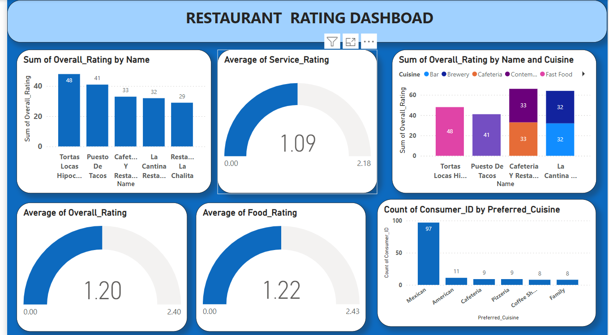
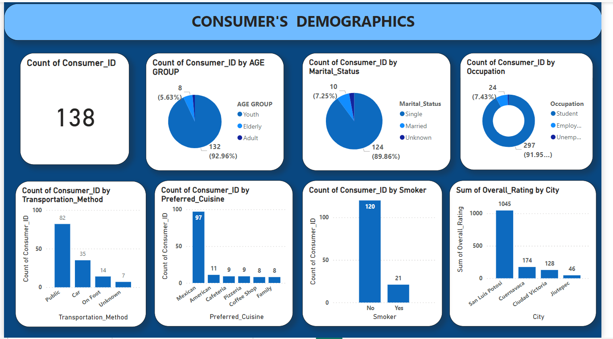

# Restaurant rating project

## Introduction
This is a power BI project called  **Restaurant rating**  which contains information about restaurants in mexico. 
The project is to analyze and derive insights to answer crucial questions and help the restaurant make data driven decisions.

## Problem statement
1.  What can you learn from the highest rated restaurants? Do consumer preferences have an effect on ratings?
2.  What are the consumer demographics? Does this indicate a bias in the data sample?
3.  Are there any demand & supply gaps that you can exploit in the market? 
4.  If you were to invest in a restaurant, which characteristics would you be looking for?

## Skills Demonstrated:
The following Power Bi features were incorporated:
- Data cleaning, 
- New column, 
- Data modelling,
- Filters,
- Tooltips

## Visualization:
The report comprises of 2 pages:
1. Restaurant rating
2. Consumers demographics

## Features 
- Consist of five column chat use to display the sum of overll ratings to restaurant, preffered cuisine.
- 3 gauge chat use to show the average of food rating, service rating and overall rating.
- 3 doughut chat usedto show the age group, marital status and occupation.

##Analysis
### Restaurant Rating

It consists of the highest rated restaurant which is Tortas Locas Hipocampo.
The average service rating, the average overall rating and the average food rating.
The preferred cuisine is Mexican.  
It has the sum of overall rating by name and cuisine which shows us that the highest rated restaurant does not serve Mexican dishes,  Instead they serve fast food.

### Consumer Demographic 

Shows us the count of consumers id which is 138
Consist of consumers demographics which include age_group, marital_status, occupation, transportation method, city, preferred cuisine.

## Conclusion and Recommendation
- The customers preference does not have an effect on the overall rating, because going through the preferred cuisine most of the customers preferred Mexican food but the highest rated restaurant serves fast food.
- The customer demographics does indicate a bias in the data sample because there are more single people amongst the customers which makes them opt out for fast food.

- The demand for Mexican food can be worked on by making the highest rated restaurant incorporate it along with what they serve

- Go for a restaurant with a high rating, The one easily accessible to the people, user friendly.

